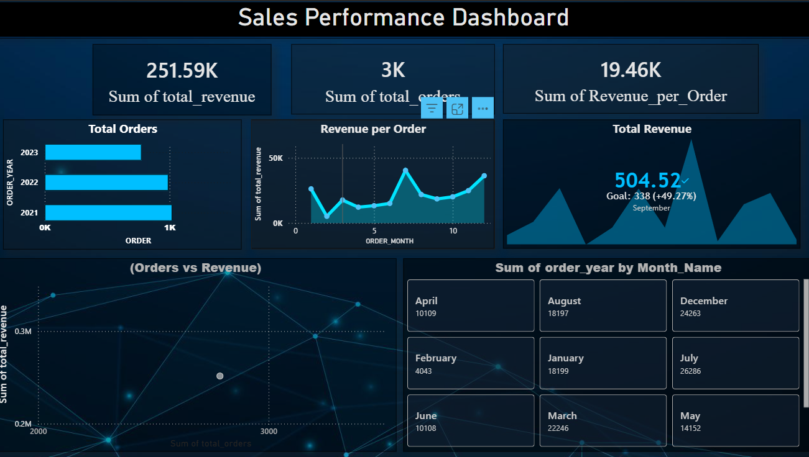

# 📊 Sales Performance 

## 🚀 Project Overview

This project focuses on analyzing sales data to uncover key business insights such as revenue trends, order patterns, and performance across time.

Using **Python for data analysis** and **Power BI for visualization**, the project transforms raw data into an interactive dashboard for decision-making.

---

## 🎯 Objectives

* Analyze total revenue and order trends
* Identify monthly and yearly performance patterns
* Understand the relationship between orders and revenue
* Build an interactive dashboard for data-driven insights

---

## 🛠️ Tools & Technologies

* **Python** (Pandas, NumPy)
* **Matplotlib & Seaborn** (Visualization)
* **Power BI** (Dashboard Creation)
* **Git & GitHub** (Version Control)

---

## 📂 Dataset

The dataset contains the following fields:

* `order_year` → Year of order
* `order_month` → Month of order
* `total_revenue` → Revenue generated
* `total_orders` → Number of orders

---

## 🔍 Key Features

### 📌 Data Processing

* Data cleaning and preprocessing using Pandas
* Handling missing values and type conversion
* Feature engineering (Revenue per Order)

### 📊 Data Analysis

* Year-wise revenue analysis
* Month-wise trend analysis
* Correlation between orders and revenue

### 📈 Dashboard (Power BI)

* KPI Cards:

  * Total Revenue
  * Total Orders
  * Revenue per Order
* Visualizations:

  * Bar Chart (Yearly Performance)
  * Line Chart (Monthly Trends)
  * Scatter Plot (Orders vs Revenue)
* Interactive Filters (Month-wise selection)

---

## 📷 Dashboard Preview

**


---

## 💡 Key Insights

* Revenue trends vary significantly across months
* Certain months show peak sales performance
* Strong relationship observed between total orders and revenue
* Helps identify high-performing periods for business strategy

---

## 🧠 Learnings

* Hands-on experience with real-world data analysis
* Improved skills in data visualization and storytelling
* Understanding of dashboard design principles
* Practical exposure to Power BI and data-driven decision making

---

## 📌 Future Improvements

* Add region-wise or product-wise analysis
* Integrate real-time data
* Enhance dashboard interactivity
* Deploy dashboard for web access

---

## 🔗 Project Structure

```
Sales-Data-Analysis/
│── Project2.ipynb
│── sales_data_sample.csv
│── dashboard.pbix
│── README.md
```

---

## 🤝 Contribution

Feel free to fork this repository and improve the project.

---

## ⭐ Acknowledgment

This project was developed as part of my learning journey in **Data Science and Data Analytics**.

---
